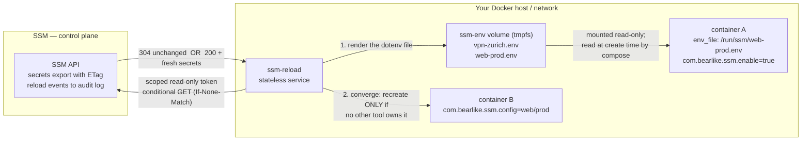
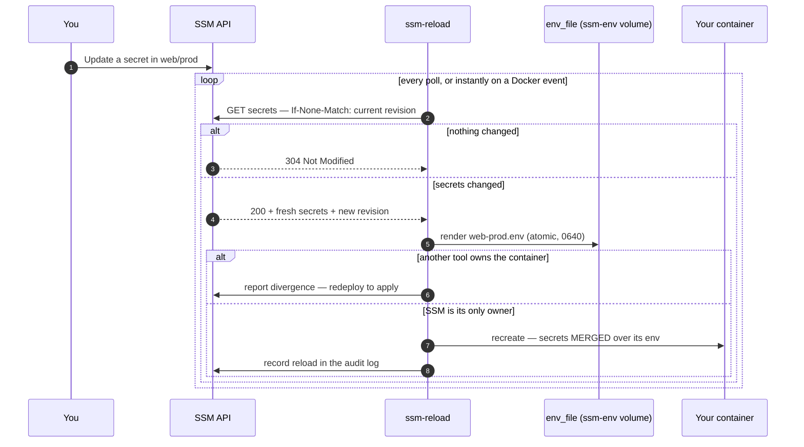
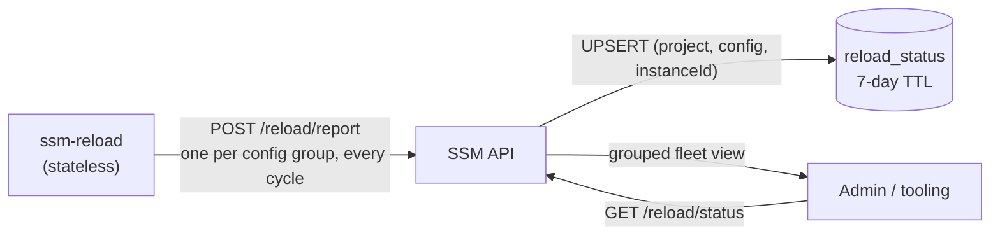

# Secrets Reloader (`ssm-reload`)

Keep your **running Docker containers automatically in sync with their
secrets**. When you change a secret in Simple Secrets Manager, `ssm-reload`
delivers the new values to the file your stack reads at deploy time, and
recreates the containers it owns — no manual redeploys, no hand-edited `.env`
files, no restarts to remember.

Think of it as **Watchtower for secrets**: instead of watching for a new
image, `ssm-reload` watches for a secret change and rolls the workload
forward.

---

## Why you want this

Docker bakes environment variables (and Compose file-secrets) into a
container at **create time**. Once a container is running, changing a
secret upstream does nothing until you rebuild or redeploy it by hand. On a
self-hosted stack that usually means editing `.env` files and running
`docker compose up` again — easy to forget, easy to get wrong, and
invisible to the rest of the team.

`ssm-reload` closes that gap: it **detects** the change, **renders** the fresh
values to the file your stack already reads, and **recreates** the containers
it owns — safely, and with a visible audit trail.

---

## How it works

`ssm-reload` is a small, standalone service you run next to your workloads.
It talks to just two things: the **SSM API** (with a read-only, scoped
token) and the **local Docker socket**. It stores nothing of its own — a
container's subscription and its current secret version live entirely on
the container's **labels**, so you can run one copy per host or network
without any coordination between them.

It does two deliberately separate jobs. The distinction is the whole design,
so it is worth ten seconds:

**1. Delivery (projection).** A container's environment is frozen at *create*
time — only its creator can set it. So `ssm-reload` writes each managed config
to `/run/ssm/<project>-<config>.env` inside a shared, RAM-backed Docker volume,
and your stack names that file with `env_file:`. Your containers are then
**born** with the right secrets, on their very first boot. (Post-hoc injection
cannot do this: the container starts without its secrets, crashes, and only then
can anything react.)

**2. Convergence.** When a config's secrets change, `ssm-reload` recreates the
containers that have **no other lifecycle owner**. A container another tool
created — a compose stack, a Portainer stack, a Swarm service — is *reported*,
never recreated: **SSM never takes a container away from its owner.** Its
`env_file` is already current, so redeploying it is all that is needed.



Under the hood the check is cheap: `ssm-reload` asks the API "has anything
changed?" using a content fingerprint (an HTTP `ETag`). Most of the time the
answer is "no" (a tiny `304` response), and it only downloads secrets when
something actually changed.

### What happens when you change a secret



A container that is already correct — because it was *born* from the rendered
`env_file` — is simply **adopted**: no restart, no churn.

---

## Quick start

### 1. Create a scoped token for the service

In the Admin Console, create a **service token** scoped to the project(s)
you want managed and choose the **Reloader (read + report)** access preset —
it grants exactly `secrets:read`, `secrets:export` (to export config secrets),
and `reload:report` (so reloads and per-cycle status are recorded and
surfaced in the Reloader Fleet view). Treat it as read-only — it can read
secrets and report reloads, nothing else. (The preset is offered for service
tokens only; `reload:report` is never granted through a personal/role token.)

### 2. Run the `ssm-reload` service

**Easiest path — already running the root stack?** The repository
`docker-compose.yml` ships `ssm-reload` behind an opt-in `reload` Compose
profile, so a plain `docker compose up` never starts it:

```bash
SSM_RELOAD_TOKEN=<token from step 1> docker compose --profile reload up -d
```

**Standalone deployment?** A ready-to-copy example lives at
[`ssm_reload/docker-compose.example.yml`](../ssm_reload/docker-compose.example.yml).
The essentials:

```yaml
volumes:
  ssm-env:                 # where configs are projected. RAM-backed: secrets
    name: ssm-env          # never touch the disk, and vanish with the fleet.
    driver: local
    driver_opts:
      type: tmpfs
      device: tmpfs
      o: size=8m,mode=0750

services:
  ssm-reload:
    image: ghcr.io/bearlike/ssm-reload:latest
    restart: unless-stopped
    environment:
      SSM_BASE_URL: "http://ssm:5000/api"      # API root that serves /projects and /reload
      SSM_TOKEN: "${SSM_RELOAD_TOKEN}"         # the read-only scoped token from step 1
      SSM_RELOAD_POLL_INTERVAL: "30"           # seconds between drift checks
      SSM_RELOAD_PROJECTION_CONFIGS: "web/prod"  # render these before anything is bound
    volumes:
      - /var/run/docker.sock:/var/run/docker.sock:ro
      - ssm-env:/run/ssm                       # ssm-reload WRITES the dotenv files here
```

Run **one `ssm-reload` per Docker host** — it only manages its own local
daemon.

### 3. Point your container at the projected file, and opt it in

```yaml
services:
  web:
    image: myorg/web-api:1.4.2
    env_file:
      - /run/ssm/web-prod.env             # secrets, projected by SSM
    environment:                          # app-native config, stays in git
      LOG_LEVEL: info
    volumes:
      - ssm-env:/run/ssm:ro               # read-only: consumers never write here
    labels:
      com.bearlike.ssm.enable: "true"     # opt in — nothing touched without this
      com.bearlike.ssm.config: "web/prod" # which project/config this tracks
      # com.bearlike.ssm.revision and .keys are managed by ssm-reload — do not set them
```

Compose **merges** `env_file` and `environment`, so your app-native variables
survive alongside the injected secrets. And because compose folds an
`env_file`'s *contents* into its config hash, a `docker compose up -d` after a
secret change recreates exactly the affected services, in dependency order —
carrying `network_mode: "service:X"` dependents along with them.

Change a secret in `web/prod` and, within one poll interval, `ssm-reload`
re-renders `web-prod.env`. If SSM is `web`'s only owner it recreates it for
you; if compose owns it, the fleet view tells you to redeploy — and the
redeploy brings it up already correct.

> **Bootstrap:** compose refuses to start a service whose `env_file` does not
> exist, and on a first deploy no container carries the label yet. List the
> config in `SSM_RELOAD_PROJECTION_CONFIGS`, or run
> `ssm secrets materialize --dir /run/ssm --project web --config prod` once. The
> CLI and the reloader render byte-identical files, so they never fight.

> **`env_file` is resolved by the compose *client*, not the daemon.** A
> containerized compose client (Portainer, a CI runner) must mount `ssm-env`
> into *itself* too, or it cannot read the file it is passing to the daemon.
> Portainer is just one consumer of the volume — there is no Portainer-specific
> code in SSM.

---

## Configuration reference

### Service environment variables

Canonical reference for every variable — name, required/optional, default,
description — for both the reloader and the server:
[`ENV_REFERENCE.md`](ENV_REFERENCE.md). Behavior worth calling out beyond
that generated table:

- `SSM_BASE_URL` must serve `/projects/...`, `/reload/events`, and
  `/reload/report` (e.g. `http://ssm:5000/api`).
- `SSM_RELOAD_POLL_INTERVAL`: an invalid value (non-numeric, `0`, or
  negative) fails fast on start-up rather than silently reverting to the
  30-second default.
- `SSM_RELOAD_LOG_LEVEL` is accepted case-insensitively (`debug`,
  `Warning`, `ERROR`, ...).
- `SSM_RELOAD_PROJECTION_CONFIGS` is a comma-separated list of
  `project/config` pairs to render **even when no container is bound to them**
  — the bootstrap case, since compose will not start a stack whose `env_file`
  is missing.

Two facts about delivery and convergence that are not configurable, but are
worth knowing:

- Configs are always rendered to `/run/ssm` — mount the `ssm-env` volume
  there in any container that needs to read them.
- A freshly created container is left alone for a short settling window, so
  a deploy in flight is never yanked out from under the tool performing it.

### Container labels (the control plane)

Labels use the fixed reverse-DNS prefix `com.bearlike.ssm` (the Docker
convention for third-party object labels).

| Label | Who sets it | Meaning |
| --- | --- | --- |
| `com.bearlike.ssm.enable=true` | you | Opt in. No label ⇒ the container is invisible to `ssm-reload`. |
| `com.bearlike.ssm.config=<project>/<config>` | you | Binds the container to a project + config. |
| `com.bearlike.ssm.revision=<value>` | `ssm-reload` | The secret version the container currently holds. Managed automatically — visible in `docker inspect` / Portainer for transparency. |
| `com.bearlike.ssm.keys=<A,B,C>` | `ssm-reload` | The key names SSM last injected. It is what lets a key you *delete* from a config be pruned from the container, instead of lingering in its environment forever. |

`ssm-reload` also *reads* one label it never writes: `com.docker.compose.project`.
Its presence means another tool created the container — see below.

---

## What to expect (behavior)

- **Born correct, then adopted.** A container created from the projected
  `env_file` already has the right secrets, so `ssm-reload` simply **adopts**
  it: no restart, no churn. That is the steady state.
- **Recreate, not restart.** When SSM *is* the only owner, new environment can
  only be applied by recreating the container (a plain restart keeps the old
  values) — the same, cheap operation `docker compose up -d` performs.
- **A recreate MERGES, it never replaces.** Fresh secrets are overlaid on the
  container's existing environment, so every variable your compose file set
  survives. Only keys you *removed* from the config are pruned (tracked via
  `com.bearlike.ssm.keys`).
- **SSM never takes a container away from its owner.** A container carrying a
  `com.docker.compose.project` label was created by compose (or by Portainer,
  or a Swarm service). It is **reported as divergent and left alone**; you
  redeploy it, and it comes back born-correct. Recreating it would race that
  tool's own deploys.
- **Never recreates mid-deploy.** A container created seconds ago, or created
  but not yet started, is left to settle for a short window before the
  reloader will touch it.
- **Never orphans a network namespace.** A container that donates its netns to
  another owner's container (`network_mode: "service:X"`) is not recreated: a
  recreate mints a new container id and would strand the dependents. Redeploy
  the stack instead — compose moves them together.
- **Safe by default.** A container is only ever touched if it carries
  `com.bearlike.ssm.enable=true`.
- **Never leaves you worse off.** The recreate is non-destructive: the
  original is kept aside and only removed after the replacement is
  confirmed running. If anything goes wrong, the original is restored and
  the change is retried on the next pass — a failed reload never takes a
  healthy container down.
- **If SSM is unreachable, nothing happens.** A network blip or API outage
  is treated as "no change" — `ssm-reload` never tears a container down
  because it couldn't reach the control plane.
- **Efficient.** Many containers on the same config are checked with a
  single request, and unchanged configs cost only a tiny `304`.
- **Instant adoption.** New or redeployed containers are picked up almost
  immediately via the Docker event stream, not just on the next poll.
- **Transparent.** The held revision is a label (visible in Portainer), and
  every reload is written to the SSM **audit log** as a `reload.applied`
  event.

### ⚠️ Migration: compose-owned containers are no longer recreated

If you already run `ssm-reload`, one behavior has changed deliberately:

- **Before:** any labelled container was recreated when its secrets changed —
  including containers compose created. That raced compose's own deploys (the
  reloader renamed a container aside mid-`compose up`, and the deploy failed),
  and it **replaced the container's whole environment**, dropping every variable
  that came from the compose file but not from the SSM config.
- **Now:** such a container is reported as divergent and left alone. It appears
  as `error` in the Reloader Fleet view with a message telling you to redeploy.

**Do this:** move those services onto the `env_file` pattern above. A
`docker compose up -d` then applies the secrets, and the container comes up
correct on its first boot rather than crash-looping until the reloader catches
it. There is no setting to bring the old recreate behavior back — it raced
your deploys and silently dropped compose-file-only variables.

---

## Monitoring the fleet

Every reconcile pass — including the steady-state `304` "nothing changed"
cycle — reports one status heartbeat **per `(project, config)` group** to the
server, so admins can see the whole pipeline end to end, not just the moments a
container was recreated. The reloader stays stateless: the heartbeat is a fresh
POST each cycle, and the server keeps only the latest per instance.

### The report flow



- **`POST /reload/report`** (scope `reload:report`, service tokens only) — the
  reloader upserts one document per `(project, config, reporterInstance)`. It is
  deliberately **not** written to the audit log: a ~30 s heartbeat would flood
  the trail. The meaningful event — an applied recreate — still lands in the
  audit log via `POST /reload/events` as a `reload.applied` event.
- **`GET /reload/status`** (scope `audit:read`) — returns the fleet view,
  grouped per config, with every reporting instance and its per-unit outcomes.
  Optional `?project=<slug>` (and, with it, `?config=<slug>`) narrows the view.
- The read model self-heals: rows are keyed by reporter instance (bounding the
  row count to the live fleet) and carry a **7-day TTL** on `lastSeenAt`, so a
  decommissioned reloader ages out on its own.

### Response shape (`GET /reload/status`)

```json
{
  "status": "OK",
  "data": [
    {
      "project": "web",
      "config": "prod",
      "instances": [
        {
          "host": "docker-1",
          "instanceId": "…uuid…",
          "version": "0.1.0",
          "lastSeenAt": "…ISO-8601 timestamp…",
          "trigger": "poll",
          "revision": "\"abc123\"",
          "outcome": "current",
          "error": null,
          "units": [
            {
              "id": "…container id…",
              "name": "web",
              "heldRevision": "\"abc123\"",
              "outcome": "current",
              "error": null
            }
          ]
        }
      ]
    }
  ]
}
```

Group `outcome` is `current` (a 304 cycle, or every unit already up to date),
`updated` (at least one recreate happened), or `error` (export failed or every
divergent unit failed to recreate). Per-unit `outcome` is `current`,
`recreated`, `failed`, or `skipped`.

### OpenTelemetry events (opt-in)

Set `OTEL_EXPORTER_OTLP_ENDPOINT` (OTLP/HTTP) on the reloader and/or the server
to export structured events alongside the human-readable logs. Unset, emission
is a no-op with zero cost. Events carry semantic-convention attributes
(`container.id`, `container.name`) plus domain attributes namespaced `ssm.*`
(`ssm.project`, `ssm.config`, `ssm.outcome`, `ssm.trigger`,
`ssm.revision.from`, `ssm.revision.to`).

| Event name | Emitted when |
| --- | --- |
| `ssm_reload.cycle.started` / `.completed` | A reconcile pass begins / ends. |
| `ssm_reload.export.decision` | After the conditional export (`ssm.outcome` = `304` / `200` / `error`). |
| `ssm_reload.recreate.started` / `.succeeded` / `.rolled_back` | Around each container recreate. |
| `ssm_reload.binding.invalid` | A managed container has a malformed binding label. |
| `ssm_reload.unit.adopted` | A container recreated by another tool is adopted without a restart because its env already matches the exported secrets. |
| `ssm_reload.report.sent` | A per-group status report was POSTed. |
| `ssm_server.reload.report_accepted` | The server accepted a status report. |

---

## Run it anywhere, at any scale

`ssm-reload` is stateless and isolated — it depends only on the SSM API and
a local Docker socket, and stores nothing itself. That means you can run:

- **one per Docker host**,
- **one per isolated network / DMZ**, or
- **many across your fleet**,

each with its own least-privilege token, all pointing at the same SSM
server. Because each instance only manages its own daemon, they never
conflict and need no coordination.

---

## Security notes

- The scoped token lives **on the service** (`SSM_TOKEN`), never in a
  container label — labels are readable by anyone who can run
  `docker inspect`.
- Give the token the **least privilege** it needs: `secrets:export` for the
  project(s) it serves, plus `reload:report` for the audit trail.
- **Projected secrets never touch the disk.** The `ssm-env` volume is
  RAM-backed (tmpfs), it is created mode `0750`, and each file is written
  `0640`. Its contents exist only while a container holds it mounted, so they
  cannot outlive the fleet. If you create the volume yourself *without* the
  tmpfs options, `ssm-reload` warns you loudly — a plain
  `docker run -v ssm-env:/run/ssm` auto-creates a disk-backed volume.
- Secrets still land in the container's environment (that is what `env_file`
  does), so they remain visible via `docker inspect` and `/proc/<pid>/environ`
  — the same exposure as any environment-based secret. Images that read secret
  *files* natively (gluetun's `*_SECRETFILE`, postgres' `*_FILE`) can point at
  the same volume and skip the environment entirely.
- Mount the Docker socket **read-only** and run the service with least host
  privilege. Note that anyone with the Docker socket is already
  root-equivalent on the host, so the plaintext file in tmpfs barely widens
  the blast radius.

---

## Scope and limitations

- **Docker only.** Kubernetes support is designed for and can be added
  behind the same interface later; today `ssm-reload` manages Docker
  containers. The projection sink is a seam too — a Kubernetes Secret slots in
  behind the same renderer.
- **Pull-based.** `ssm-reload` polls and watches Docker events; it does not
  require the SSM server to push to it.
- **The tmpfs volume is empty after a reboot.** The reloader re-renders every
  config it can see when it starts (that is what `SSM_RELOAD_PROJECTION_CONFIGS`
  is for), but if it is the volume's only holder and it stops, a deploy in that
  window fails on a missing `env_file`. The projection directory and volume
  name are fixed, not configurable — if you prefer durability over RAM-only,
  pre-create a volume named `ssm-env` yourself with a disk-backed driver before
  starting `ssm-reload`; it detects the volume already exists, warns loudly
  that it is not tmpfs-backed, and uses it as-is rather than failing.
- **SSM's own recreate leaves compose's config hash stale.** Your next manual
  `compose up` will therefore perform one extra, harmless recreate.

---

## Related

- CLI runtime injection for one-off processes / CI: [`docs/CLI.md`](CLI.md)
  (`ssm-cli run -- <command>`)
- First-time setup and tokens: [`docs/FIRST_TIME_SETUP.md`](FIRST_TIME_SETUP.md)
