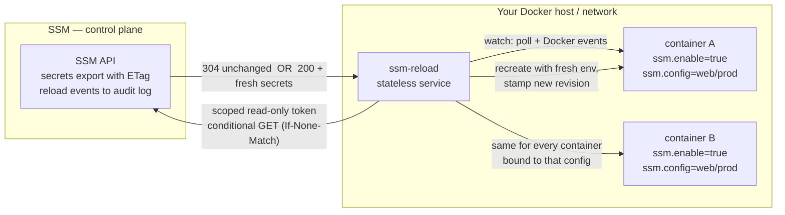
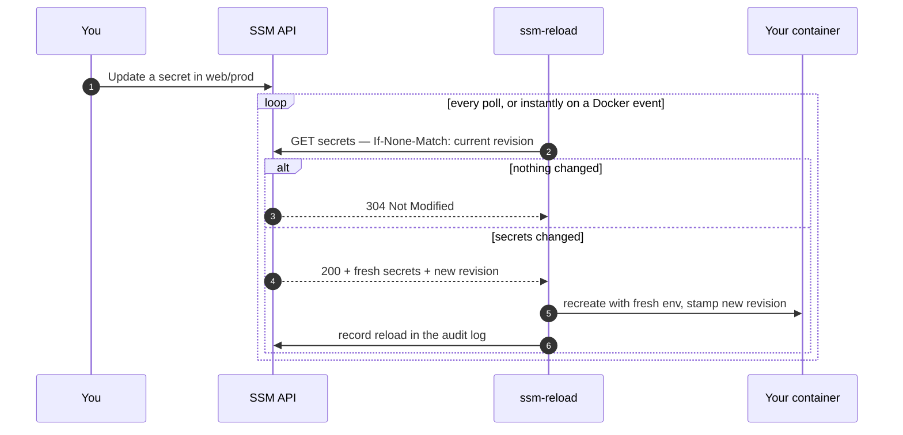

# Secrets Reloader (`ssm-reload`)

Keep your **running Docker containers automatically in sync with their
secrets**. When you change a secret in Simple Secrets Manager, every
container that subscribes to that config is recreated with the new values —
no manual redeploys, no hand-edited `.env` files, no restarts to remember.

Think of it as **Watchtower for secrets**: instead of watching for a new
image, `ssm-reload` watches for a secret change and rolls the container
forward.

---

## Why you want this

Docker bakes environment variables (and Compose file-secrets) into a
container at **create time**. Once a container is running, changing a
secret upstream does nothing until you rebuild or redeploy it by hand. On a
self-hosted stack that usually means editing `.env` files and running
`docker compose up` again — easy to forget, easy to get wrong, and
invisible to the rest of the team.

`ssm-reload` closes that gap: it **detects** the change, **fetches** the
fresh values, and **recreates** the affected containers for you — safely,
and with a visible audit trail.

---

## How it works

`ssm-reload` is a small, standalone service you run next to your workloads.
It talks to just two things: the **SSM API** (with a read-only, scoped
token) and the **local Docker socket**. It stores nothing of its own — a
container's subscription and its current secret version live entirely on
the container's **labels**, so you can run one copy per host or network
without any coordination between them.



Under the hood the check is cheap: `ssm-reload` asks the API "has anything
changed?" using a content fingerprint (an HTTP `ETag`). Most of the time the
answer is "no" (a tiny `304` response), and it only downloads secrets when
something actually changed.

### What happens when you change a secret



---

## Quick start

### 1. Create a scoped token for the service

In the Admin Console, create a **service token** scoped to the project(s)
you want managed, with the **`secrets:export`** permission (add
**`reload:report`** so reloads are recorded in the audit log). Treat it as
read-only — it can read secrets and report reloads, nothing else.

### 2. Run the `ssm-reload` service

**Easiest path — already running the root stack?** The repository
`docker-compose.yml` ships `ssm-reload` behind an opt-in `reload` Compose
profile, so a plain `docker compose up` never starts it:

```bash
SSM_RELOAD_TOKEN=<token from step 1> docker compose --profile reload up -d
```

**Standalone deployment?** A ready-to-copy example lives at
[`ssm_reload/docker-compose.example.yml`](../ssm_reload/docker-compose.example.yml).
The essentials:

```yaml
services:
  ssm-reload:
    image: ghcr.io/bearlike/ssm-reload:latest
    restart: unless-stopped
    environment:
      SSM_BASE_URL: "http://ssm:5000/api"      # API root that serves /projects and /reload
      SSM_TOKEN: "${SSM_RELOAD_TOKEN}"         # the read-only scoped token from step 1
      SSM_RELOAD_POLL_INTERVAL: "30"           # seconds between drift checks
    volumes:
      - /var/run/docker.sock:/var/run/docker.sock:ro
```

Run **one `ssm-reload` per Docker host** — it only manages its own local
daemon.

### 3. Opt a container in with two labels

```yaml
services:
  web:
    image: myorg/web-api:1.4.2
    labels:
      ssm.enable: "true"          # opt in — nothing is touched without this
      ssm.config: "web/prod"      # which project/config this container tracks
      # ssm.revision is managed by ssm-reload — do not set it yourself
```

That's it. Change a secret in `web/prod`, and within one poll interval (or
instantly, if the container was just (re)deployed) `ssm-reload` recreates
`web` with the new environment.

---

## Configuration reference

### Service environment variables

| Variable | Required | Default | Purpose |
| --- | --- | --- | --- |
| `SSM_BASE_URL` | ✅ | — | API root that serves `/projects/...` and `/reload/events` (e.g. `http://ssm:5000/api`). |
| `SSM_TOKEN` | ✅ | — | Read-only, scoped service token. Env-only; never logged. |
| `SSM_RELOAD_POLL_INTERVAL` | | `30` | Seconds between drift checks. |
| `SSM_RELOAD_LABEL_PREFIX` | | `ssm` | Label namespace, if you need to avoid a collision. |
| `DOCKER_HOST` | | local socket | Standard Docker endpoint override. |

### Container labels (the control plane)

| Label | Who sets it | Meaning |
| --- | --- | --- |
| `ssm.enable=true` | you | Opt in. No label ⇒ the container is invisible to `ssm-reload`. |
| `ssm.config=<project>/<config>` | you | Binds the container to a project + config. |
| `ssm.revision=<value>` | `ssm-reload` | The secret version the container currently holds. Managed automatically — visible in `docker inspect` / Portainer for transparency. |

---

## What to expect (behavior)

- **Recreate, not restart.** New environment can only be applied by
  recreating the container (a plain restart keeps the old values), so
  reloads briefly recreate the container — the same, cheap operation
  `docker compose up -d` performs when config changes.
- **Safe by default.** A container is only ever touched if it carries
  `ssm.enable=true`.
- **Never leaves you worse off.** The recreate is non-destructive: the
  original is kept aside and only removed after the replacement is
  confirmed running. If anything goes wrong, the original is restored and
  the change is retried on the next pass — a failed reload never takes a
  healthy container down.
- **If SSM is unreachable, nothing happens.** A network blip or API outage
  is treated as "no change" — `ssm-reload` never tears a container down
  because it couldn't reach the control plane.
- **Efficient.** Many containers on the same config are checked with a
  single request, and unchanged configs cost only a tiny `304`.
- **Instant adoption.** New or redeployed containers are picked up almost
  immediately via the Docker event stream, not just on the next poll.
- **Transparent.** The held revision is a label (visible in Portainer), and
  every reload is written to the SSM **audit log** as a `reload.applied`
  event.

---

## Run it anywhere, at any scale

`ssm-reload` is stateless and isolated — it depends only on the SSM API and
a local Docker socket, and stores nothing itself. That means you can run:

- **one per Docker host**,
- **one per isolated network / DMZ**, or
- **many across your fleet**,

each with its own least-privilege token, all pointing at the same SSM
server. Because each instance only manages its own daemon, they never
conflict and need no coordination.

---

## Security notes

- The scoped token lives **on the service** (`SSM_TOKEN`), never in a
  container label — labels are readable by anyone who can run
  `docker inspect`.
- Give the token the **least privilege** it needs: `secrets:export` for the
  project(s) it serves, plus `reload:report` for the audit trail.
- Secrets are injected as environment variables, so they are visible via
  `docker inspect` and `/proc/<pid>/environ` — the same exposure as any
  environment-based secret. Mount the Docker socket **read-only** and run
  the service with least host privilege.

---

## Scope and limitations (v1)

- **Docker only.** Kubernetes support is designed for and can be added
  behind the same interface later; today `ssm-reload` manages Docker
  containers.
- **Direct environment injection.** Secrets are delivered as the container's
  environment on recreate; file/volume rendering is not part of v1.
- **Pull-based.** `ssm-reload` polls and watches Docker events; it does not
  require the SSM server to push to it.

---

## Related

- CLI runtime injection for one-off processes / CI: [`docs/CLI.md`](CLI.md)
  (`ssm-cli run -- <command>`)
- First-time setup and tokens: [`docs/FIRST_TIME_SETUP.md`](FIRST_TIME_SETUP.md)
